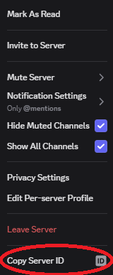

# How to configure the Discord Bridge
## Setting up the .env file
To setup the .env file, create a file in the */plugins* folder with this data:

DISCORD_BOT_TOKEN=
DISCORD_GUILD_ID=

Next, to grab the bottoken, create a bot and invite it to your discord server, making sure to copy the bot token as soon as possible. (So you don't have to reset it a ton. As someone with 2fa who doesnt get the token immediately, it is **really** frustrating.) Then, paste it into the DISCORD_BOT_TOKEN= line. It should look like this. DISCORD_BOT_TOKEN=ABCDEFGHIJKLMNOPQRSTUVWXYZ123456789 (note how it is **not** wrapped in quotes.) Next, with developer tools enabled, right click on your discord server's icon, and hit copy "Copy Server ID." 

Then paste it similarly to the bottoken, not wrapped in quotes, after the DISCORD_GUILD_ID line. When finished, upon server running it will create all necessary channels and webhooks in the discord, and start working!

> [!IMPORTANT]  
> The channel creation creats the channels **in Discord** from the **OriginChats** server list found in /db/channels.json not the other way around.